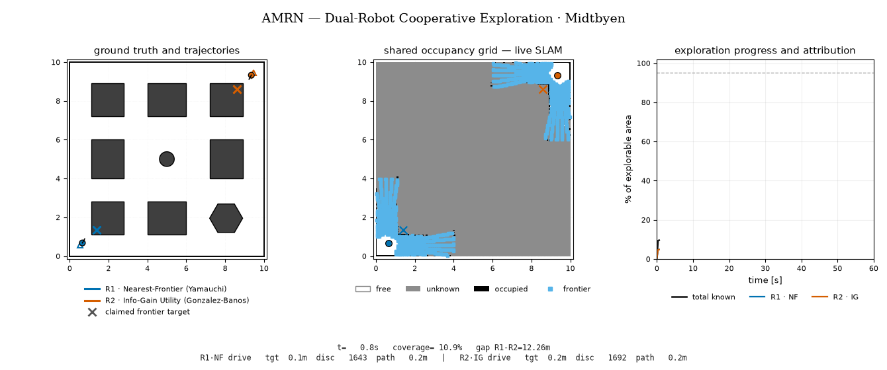
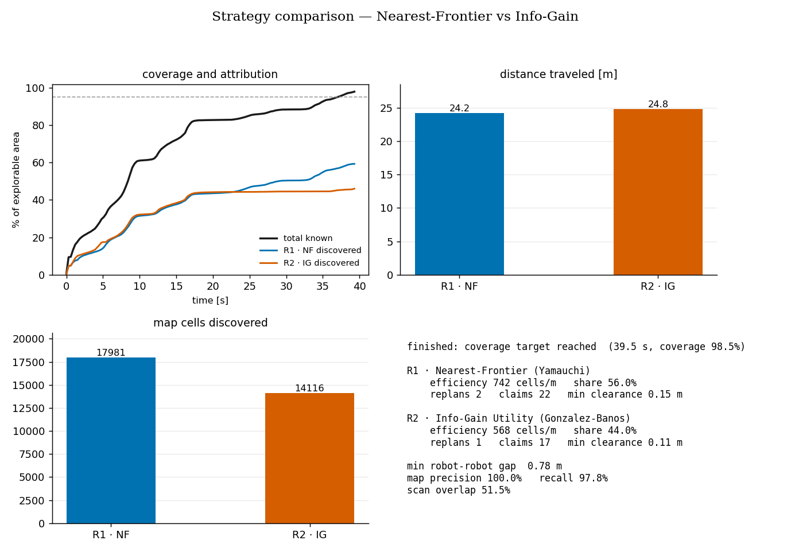
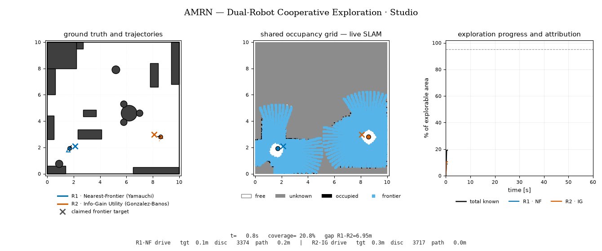
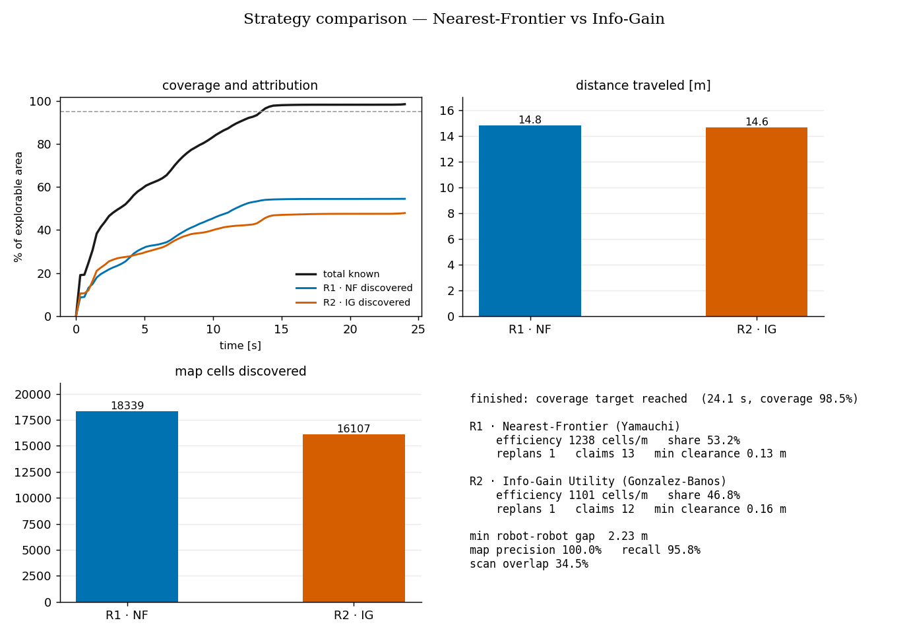
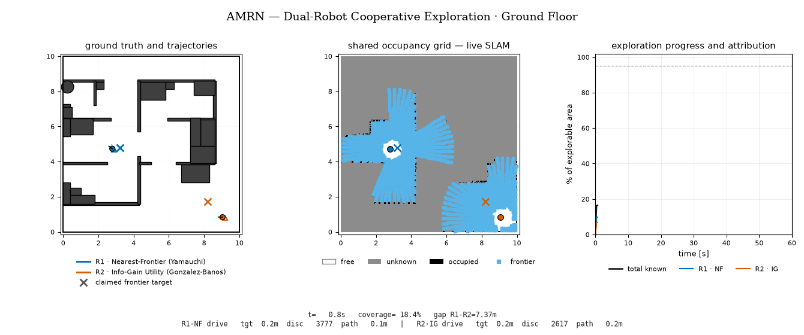
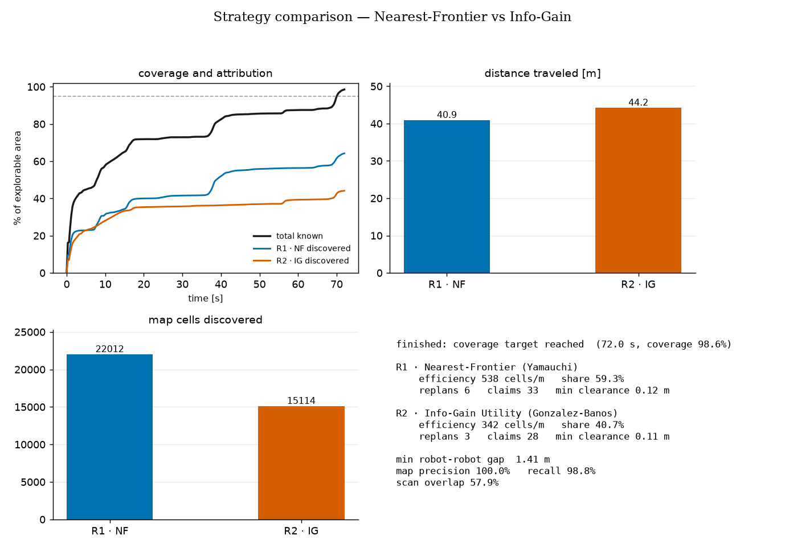

# AMRN — Dual-Robot Cooperative Exploration

Two differential-drive robots autonomously explore an unknown 10 x 10 m world.
They fuse their LiDAR scans into a **single shared occupancy grid** in real time,
coordinate so they do not chase the same frontier, keep clear of every obstacle,
and never collide with each other. Each robot runs a **different exploration
algorithm**, and the run ends with a side-by-side comparison of the two.

The live view shows three panels: the ground-truth world with both trajectories,
the shared occupancy grid as the robots build it (with frontier clusters), and
the coverage-vs-time curve with per-robot attribution. Telemetry sits in a
status bar below the maps.

## Quick start

```bash
conda env create -f environment.yml 
conda activate [YOUR_ENV_NAME]

python main.py --scenario 1      
python main.py --scenario 2 
python main.py --scenario 3
python verify.py                     # headless regression, all 3 scenarios
```


## Scenarios

### 1 · Midtbyen

The Trondheim city-centre street grid: seven building blocks, a hexagonal
church block, and the Torvet square with its statue column. Streets are
1.1–1.2 m wide, so both robots thread the same grid without meeting head-on.



The frontier-claim partition shows clearly here: the robots split the street
grid roughly in half and rarely re-scan each other's blocks.



### 2 · Studio

A one-room furnished studio apartment — bed, wardrobe, desk, sofa, dining set,
kitchen counter and island, bookshelf. All furniture sits flush with the walls
or grouped together, so there are no unexplorable slivers behind it.



One open room is the easy case: coverage saturates in about 24 s and the two
strategies land within 0.2 m of each other in distance traveled.



### 3 · Ground Floor

A real 30 x 60 ft house ground-floor plan, fully furnished: beds and
nightstands in the bedrooms, wardrobe and dresser, bath sink, corner TV + sofa
in the lounge, sofa set with coffee table in the drawing room, fridge and
counter in the kitchen, stairs, and a car on the porch — plus the passage/lawn
ring around the house.



The hardest map: many rooms behind narrow doorways. Nearest-Frontier's short
hops pay off room by room, while Info-Gain commits to bigger pockets and ends
up driving farther for a smaller share.



## Results at a glance

Numbers from the runs shown above (target: 95 % of explorable area).

| Scenario | Time to target | Coverage | Distance R1 / R2 | Discovery share R1 / R2 | Map precision / recall | Min robot-robot gap |
|---|---|---|---|---|---|---|
| 1 · Midtbyen | 39.5 s | 98.5 % | 24.2 / 24.8 m | 56.0 / 44.0 % | 100 / 97.8 % | 0.78 m |
| 2 · Studio | 24.1 s | 98.5 % | 14.8 / 14.6 m | 53.2 / 46.8 % | 100 / 95.8 % | 2.23 m |
| 3 · Ground Floor | 72.0 s | 98.6 % | 40.9 / 44.2 m | 59.3 / 40.7 % | 100 / 98.8 % | 1.41 m |

Across all three maps Nearest-Frontier discovers more cells per meter driven,
and the gap widens with map complexity (742 vs 568 cells/m in Midtbyen,
538 vs 342 cells/m in the Ground Floor plan). Info-Gain's willingness to drive
to large unknown pockets costs it on indoor maps where doorways make "large
pocket" and "far away" the same thing.

## Cooperation

- **Shared map** — both robots write every scan into one `SharedMap`; each cell
  flip from unknown to known is attributed to the robot that sensed it.
- **Frontier claims** — a selected target is claimed; frontiers within 1.8 m of
  the other robot's claim (or near the other robot itself) are penalized, which
  naturally partitions the world between the robots.
- **Obstacle safety** — planning happens only through *known-free* cells
  inflated by robot radius + margin, so unknown space is never entered blindly.
- **Robot-robot avoidance** — three layers: the other robot's LiDAR returns are
  flagged and never mapped as walls, its footprint is stamped into the planning
  grid when nearby, and a priority protocol makes the lower-priority robot yield
  (and retreat-and-replan if the standoff persists).


